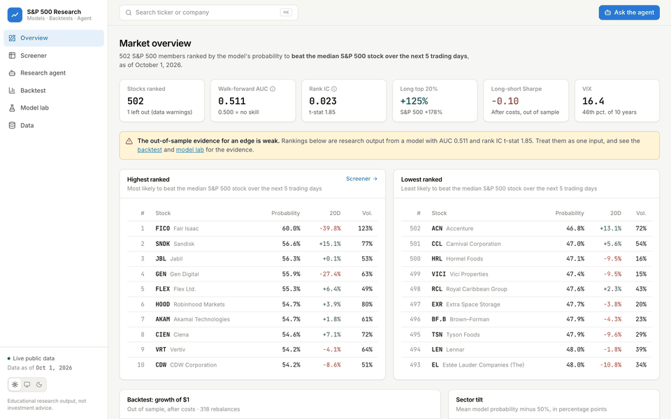
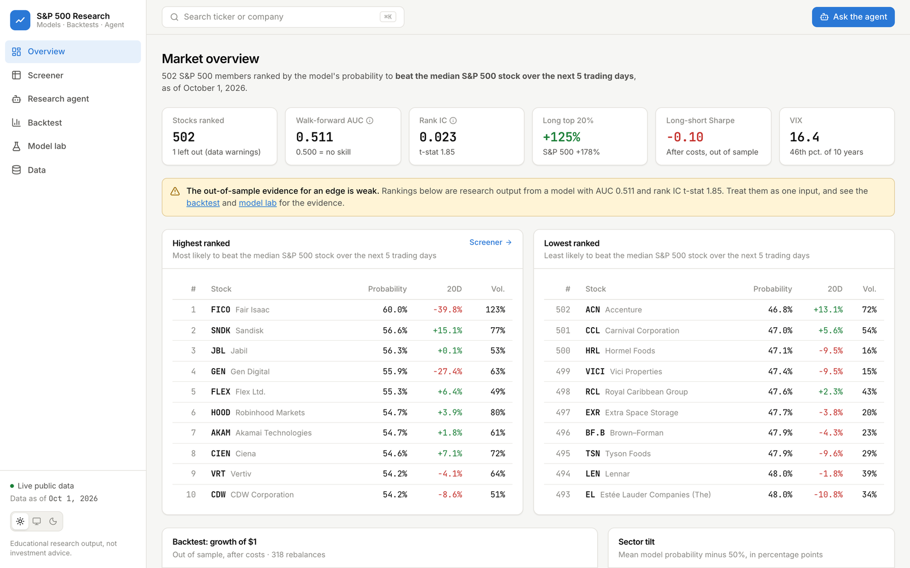
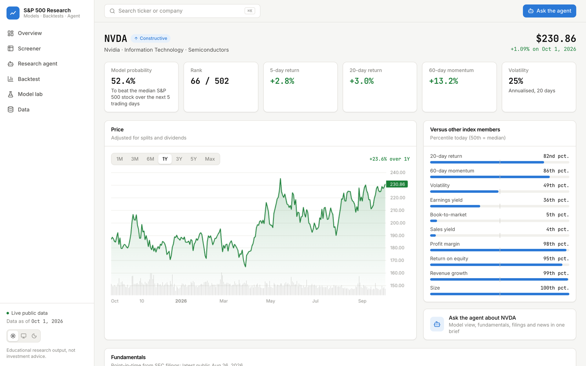
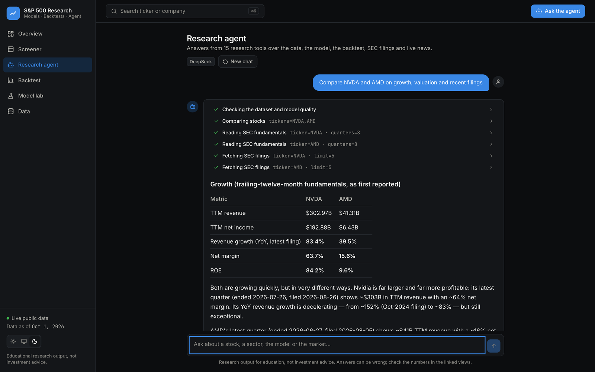
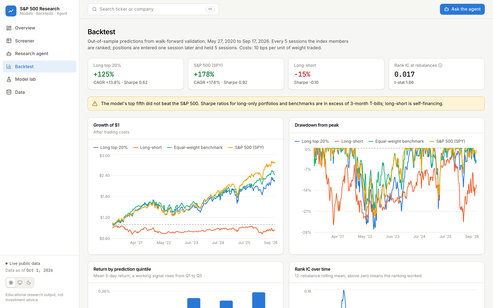
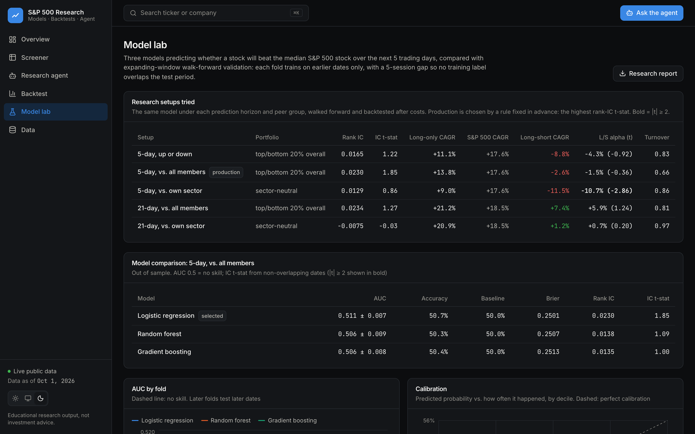
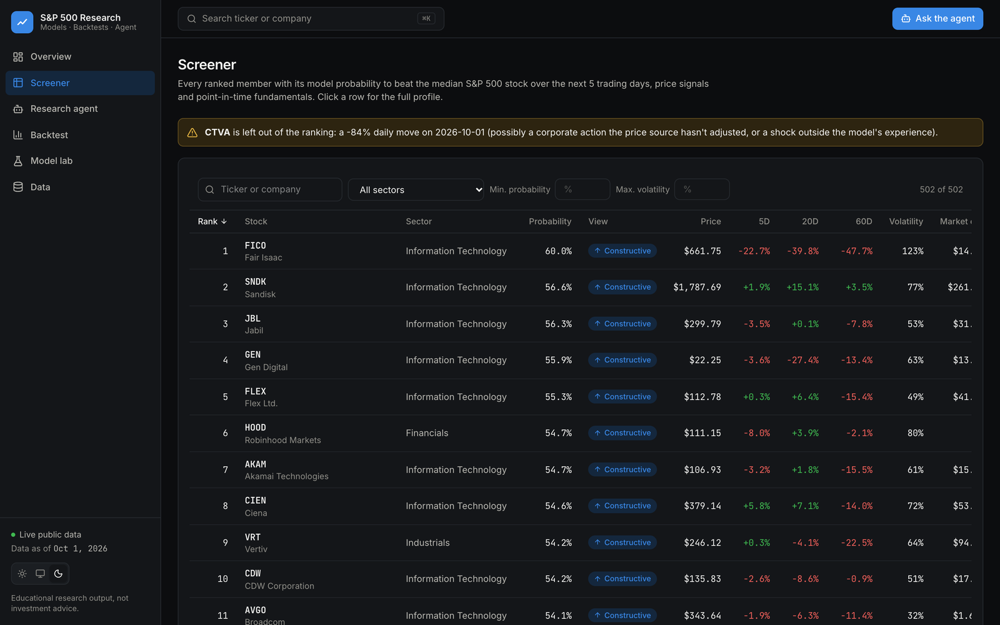

# S&P 500 Research Agent

[](https://github.com/axlezhao/SP500-Research-Agent/actions/workflows/ci.yml)

An end-to-end research platform for S&P 500 stocks, built entirely on free public data. It brings together three disciplines in one codebase:

- **Data science:** point-in-time features from prices, SEC filings and macro data, with three models compared by walk-forward validation.
- **Quant research:** an out-of-sample portfolio backtest against the S&P 500, with trading costs and a four-factor attribution.
- **AI agent:** an LLM (DeepSeek or Claude) that answers research questions by calling 15 tools over the data, the model, the backtest, and live news and SEC filings.

All of it is served through a web dashboard: a FastAPI backend and a React + TypeScript frontend.



## What it found

Can free public data rank S&P 500 stocks well enough to beat the index after costs? **Not in this setup.** Over May 2020 to September 2026, out of sample:

| Portfolio (5-day rebalance) | CAGR | Sharpe | Alpha vs. 4 factors (t) |
|---|---|---|---|
| Model's top 20% | 13.8% | 0.62 | −2.8% (−1.0) |
| Long top 20%, short bottom 20% | −2.6% | −0.10 | −1.5% (−0.4) |
| S&P 500 (SPY) | 17.6% | 0.92 | — |

- **Costs explain the gap.** Before costs, the top-20% portfolio earned 17.6% a year, the same as the index; trading every week then costs 3.8% a year.
- **Other setups don't change that.** A monthly horizon and sector-neutral portfolios were also tested; none shows alpha distinguishable from zero.

[Read the full findings →](docs/FINDINGS.md)

## Quick start

With Docker (nothing else to install):

```bash
cp .env.example .env          # set SEC_USER_AGENT (a contact email SEC requires); an LLM key is optional
docker compose up --build     # first start downloads and builds the data (~4 min), then serves the dashboard
```

Open http://localhost:8000. For an instant start on synthetic data, use `DATA_SOURCE=sample docker compose up --build`.

Without Docker (Python 3.11+, Node 20+):

```bash
pip install -r requirements.txt
cp .env.example .env
python run_pipeline.py                            # download data, run the research, train the model
cd web && npm install && npm run build && cd ..   # build the dashboard
sp500-web                                         # http://127.0.0.1:8000
```

See the [user guide](docs/GUIDE.md) for configuration, the agent and troubleshooting.

## Highlights

**Data**
- **Five free sources:** Wikipedia (index membership history), Yahoo Finance (prices), SEC EDGAR (fundamentals and filings), FRED (VIX, Treasury yields), and Yahoo RSS or Finnhub (news). All cached, with a data-quality report.
- **No look-ahead:** SEC figures are used as first reported, only from the day after filing. The model trains and trades only on stocks that were index members on each date.
- **Data cleaning:** recycled tickers, such as SunTrust's old symbol now used by another company, are detected and dropped. Unadjusted corporate actions are flagged.

**Research**
- **Walk-forward validation** with a gap as long as the prediction horizon.
- **Model comparison:** logistic regression, random forest and gradient boosting, plus calibration, permutation importance and single-signal information coefficients.
- **Five research setups** compared on every run: 5- or 21-day horizon, and beating the market, beating the stock's own sector, or simply rising. Production is chosen by a rule fixed in advance, so backtests can't be cherry-picked.
- **Backtest:** next-day execution, costs, an optional sector-neutral construction, the S&P 500 and an equal-weight benchmark. Attribution splits returns into market, size, value and momentum exposure, and alpha.

**Agent and app**
- **Research agent:** 15 tools including point-in-time fundamentals, live SEC filings and news, market conditions and the model's own evidence. Prompted to ground every number in a tool result and to state the model's limits.
- **Dashboard:** overview, screener, stock pages with TradingView charts, a chat that streams each tool call as it happens, and backtest, model and data views. Light and dark themes, ⌘K search, works on phones.
- **Engineering:** 142 offline tests; GitHub Actions runs them, builds the dashboard and smoke-tests the Docker image. A demo mode caps LLM cost for public deployments.

## Screenshots

| | |
|---|---|
|  |  |
|  |  |
|  |  |

## Documentation

| Document | What's in it |
|---|---|
| [User guide](docs/GUIDE.md) | Installation, data sources and keys, pipeline options, the dashboard, the agent, troubleshooting |
| [Architecture](docs/ARCHITECTURE.md) | How data flows, the point-in-time rules, modelling and validation, backtest and attribution, agent design, API, tests |
| [Findings](docs/FINDINGS.md) | The research question, method, results, everything that was tried and why it fell short |
| [Deployment](docs/DEPLOY.md) | Putting a public demo online, and the data-licensing and cost decisions involved |
| [Roadmap](docs/ROADMAP.md) | What's done and what could come next |

## Tech stack

**Python:** pandas, scikit-learn, FastAPI, yfinance, requests, the OpenAI SDK (for DeepSeek) and the Anthropic SDK. **Frontend:** React 19, TypeScript, Vite, Tailwind CSS 4, TanStack Query, Recharts, TradingView Lightweight Charts. **Ops:** Docker, GitHub Actions, pytest.

---

For education and research only. Nothing here is investment advice.
