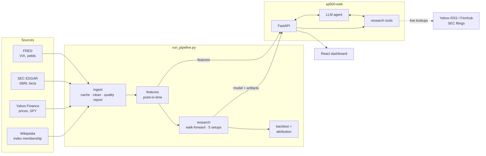

# Architecture

How the system works, from raw downloads to the dashboard. For usage, see [GUIDE.md](GUIDE.md); for results, [FINDINGS.md](FINDINGS.md).



The pipeline writes files: features, a trained model, research artifacts and a report. The server only reads them, so the dashboard keeps working while a new run is in progress, and `POST /api/reload` switches to the new results.

## Modules

| Module | Responsibility |
|---|---|
| `sources/` | One connector per source (`wikipedia`, `yahoo`, `sec`, `fred`, `news`) plus a shared `http` client with rate limiting and retries |
| `ingest.py` | Assembles a `Dataset` from live, Kaggle or sample data; caching, cleaning, data-quality report |
| `features.py` | Time-series, cross-sectional, point-in-time fundamental and macro features; targets for every horizon |
| `config.py` | Paths, horizons, and `ResearchSpec`, which defines what the model predicts |
| `model.py` | Model zoo, feature selection, final fit, scoring the latest date |
| `validation.py` | Walk-forward folds, model comparison, information coefficients, calibration, permutation importance |
| `backtest.py` | Portfolio construction, costs, benchmarks, performance statistics |
| `attribution.py` | Factor portfolios and the four-factor regression |
| `research.py` | Orchestrates a run: comparison, backtest, attribution, setup experiments, artifacts, report |
| `research_tools.py` | The agent's 15 tools and the data they read |
| `llm_agent.py` | DeepSeek and Claude tool-calling loops; terminal chat |
| `api/server.py` | FastAPI app: JSON endpoints, streamed chat, demo mode, serves the built dashboard |
| `chat.py`, `agent.py` | Rule-based chat and markdown briefs (no LLM) |
| `web/` | React + TypeScript dashboard |

## Data ingestion

**Index membership.** Wikipedia's constituents table gives today's members. The "Historical components" page gives every addition and removal with its date. Walking those changes backwards from today's list reconstructs who was in the index on any date, as `[start, end)` intervals per ticker.
- Since 2014, 758 tickers have been members.
- Changes that can't be placed (usually renamed tickers) are counted in the quality report.

**Prices.**
- **Coverage:** Yahoo prices are downloaded for current members and for every former member since the start date.
- **Two price series:** the dividend-adjusted close drives returns. An *as-traded* price (split adjustment undone, using the split history) pairs with reported share counts to give the market cap of the day.
- **Unfinished sessions:** today's bar is dropped until the market closes.

**Cleaning former members.**
- **Recycled tickers:** a former member whose price history doesn't cover at least half its time in the index is dropped. That usually means the symbol now belongs to another company, or the history was deleted after delisting.
- **After removal:** the rest are trimmed 15 days after leaving the index.
- **Coverage:** in the October 2026 run, 98 of 255 former members kept usable prices.

**SEC fundamentals.** For each company, the XBRL "company facts" are reduced to a timeline of what was publicly known:
- **Concept merging:** several XBRL concepts per metric are merged, because companies switch tags over time (e.g. `Revenues` to `RevenueFromContractWithCustomer…` after ASC 606).
- **First reported only:** each period keeps its *first-filed* value, so restatements never change history.
- **Trailing 12 months:** four consecutive quarters are chained. A missing fourth quarter is derived as the annual figure minus the first three. Quarters of 80–120 days are accepted, which covers 52/53-week calendars.
- **Other fields:** year-on-year revenue growth; equity and liabilities (backed out of total assets when liabilities aren't tagged); shares outstanding, summed across share classes.

**Caching and quality.**
- **Caching:** each source is cached in `data/raw/live/` with its own maximum age and the parameters it was fetched with.
- **Quality report:** each run records coverage, survivorship, dropped tickers, daily moves above 40%, gaps between trading days and SEC failures. It's shown in the report, the Data page and the agent's `dataset_overview` tool.

## Point-in-time rules

| Input | Usable from |
|---|---|
| Prices, returns, volatility | The close of the same day |
| SEC fundamentals | The day *after* the filing date; treated as unknown after 550 days |
| FRED macro series | The next day |
| News (dataset sources) | The same session if before 4 pm New York time, otherwise the next; weekend news moves to Monday |
| Index membership | Each date's own membership |

Cross-sectional ranks and relative targets are computed among that day's index members only.

## Features and targets

**Features** (22 with live data):
- **Price:** 5- and 20-day returns, 60-day and 12-1 month momentum, gap to the 50-day average, annualised 20-day volatility, volume relative to its 20-day average.
- **Cross-sectional ranks:** price features, plus earnings yield, sales yield, book-to-market, profit margin, ROE, revenue growth and market cap.
- **Sector-relative:** 20-day return compared with the sector median.
- **Market conditions:** VIX, its 20-day change, and the 10-year minus 3-month yield spread.
- **Automatic exclusion:** a feature missing on more than 60% of training rows, or constant, is left out. News sentiment drops out this way for live data, which has no headline history.
- **Snapshot fields:** fundamentals from the static Kaggle snapshot are display-only and never ranked, because they'd leak the future.

**Targets.** For each horizon (5 and 21 trading days):
- the forward return;
- the *tradable* return (enter one session later, hold the horizon);
- three binary targets: rises, beats the median member, beats the median of its own sector.

A peer group needs at least 4 members.

**`ResearchSpec`** picks one target: `horizon` × `relative_to` (`market`, `sector` or `absolute`). It also supplies the column names, the wording used in the app and agent, and the backtest's holding period and portfolio construction. `PRODUCTION_SPEC` is the served one; `EXPERIMENT_SPECS` are compared on every run.

## Validation and model selection

- **Folds:** expanding-window walk-forward. The first half of the dates is always training; the rest is split into five consecutive test blocks.
- **Embargo:** each fold trains on dates ending `horizon + 1` sessions before its test block, so no training label overlaps a test label.
- **Models:** logistic regression, random forest and histogram gradient boosting, all in one preprocessing pipeline (median imputation, scaling, one-hot sector).
- **Metrics:** out-of-sample AUC, accuracy against a majority-class baseline, Brier score, log loss, and rank IC (the daily Spearman correlation between prediction and forward return).
  - The IC t-stat uses dates one horizon apart. Consecutive daily ICs share most of their window, which would otherwise inflate the t-stat.
- **Diagnostics:** decile calibration, permutation importance on the last fold's unseen data, and the IC of every single feature alongside the model's.
- **Selection:** the model with the best mean AUC is refit on all labelled data and saved with its validation metrics and spec.
- **Setup experiments:** the same logistic regression runs under each `ResearchSpec`, backtested and attributed. Production is the highest IC t-stat, a rule fixed before looking at backtests.

**Scoring today.** The latest row of each current member is scored and ranked.
- **Stale data:** tickers whose last price is more than 7 days old are skipped.
- **Suspect moves:** stocks with a daily move over 40% in the last 5 sessions are left out, with a reason the agent and dashboard show. These are usually splits or spin-offs that Yahoo hasn't adjusted yet.
- **Stance:** constructive or cautious for the top or bottom 20% of the ranking.

## Backtest and attribution

**Backtest** (`run_backtest`). At every `horizon`-th date of the out-of-sample predictions:
1. **Portfolios:**
   - **Long-only:** the top quantile, equal-weighted.
   - **Long-short:** also shorts the bottom quantile, equal-weighted; dollar-neutral.
   - **Sector-neutral variant:** both pick the top and bottom quantile within every sector of 4 or more stocks.
   - **Benchmarks:** an equal-weight portfolio of all members, and SPY (dividends included) over exactly the same entry and exit sessions.
2. **Execution:** enter one session after the signal and hold for the horizon, so rebalances never overlap.
3. **Costs:** charged per unit of weight traded, measured from the previous period's weights *after* they drift with returns.
4. **Statistics:** CAGR, volatility, Sharpe (in excess of the 3-month T-bill for long portfolios; raw for long-short), drawdown, hit rate, turnover, information ratio against both benchmarks, rank IC at rebalances, and returns by prediction quintile.

**Attribution** (`attribute`). At each rebalance, factor portfolios are built from the same members:
- **SMB:** small minus big by market cap.
- **HML:** cheap minus expensive by book-to-market.
- **MOM:** 12-1 month winners minus losers.

Each takes the top and bottom 30%. MKT is SPY minus T-bills. Each strategy's per-period returns (long-only in excess of T-bills) are regressed on these four factors by OLS. The intercept, annualised, is alpha; t-stats come from standard errors, which is reasonable because periods don't overlap.

## The research agent

**Tools.** `research_tools.py` defines 15 tools as JSON schemas with plain-Python implementations:
- **What they return:** JSON-safe dicts, with NaN converted to null and numbers rounded.
- **Bad input:** arguments are validated, and errors come back as messages the model can act on, such as an unknown ticker with suggested alternatives.
- **Live lookups:** `recent_news` and `recent_filings` call Yahoo RSS or Finnhub and SEC EDGAR, cached per session.

**Loop.** `llm_agent.py` runs a manual tool-calling loop for each provider, with the same tools and system prompt for both:

| | DeepSeek | Claude |
|---|---|---|
| API | OpenAI-compatible Chat Completions | Anthropic Messages (beta endpoint) |
| Default model | `deepseek-v4-pro` | `claude-opus-5-5`, medium effort |
| Extras | none | prompt caching; server-side refusal fallback |
| Tool rounds | up to 8, then answers without tools | up to 8, then answers without tools |

- **History:** append-only. Each turn adds the model's messages exactly as returned, plus the tool results. Rewriting earlier turns would break caching and invalidate the model's earlier reasoning.
- **Truncated tool calls:** if a response is cut off mid-call, the pending call gets an error result so the conversation stays valid.
- **Progress events:** an optional `on_event` callback emits `tool_start` and `tool_end` for each call; the web chat streams these.

**System prompt.** It tells the agent to:
- use only tool data and state the as-of date;
- treat headlines as context, not proof;
- present the model's probabilities as weak, noisy evidence;
- not give buy or sell instructions.

## API and dashboard

**API.** `api/server.py` builds the FastAPI app with `create_app()`, whose arguments make every dependency injectable for tests.
- **Data loading:** research data loads once, thread-safely, and reloads on `POST /api/reload`.
- **Endpoints:** `/api/overview`, `/api/stocks`, `/api/search`, `/api/stocks/{ticker}` (plus `/prices`, `/fundamentals`, `/news`, `/filings`), `/api/backtest`, `/api/model`, `/api/model/report` and `/api/data`. Interactive docs are at `/docs`.
- **Chat:** `POST /api/agent/chat` runs the agent in a worker thread and streams server-sent events (`tool_start`, `tool_end`, then `answer` or `error`).
  - **Sessions:** each browser tab's conversation lives in an LRU cache of up to 50 per-session agents.
  - **Without a key:** the rule-based assistant answers.
- **Demo mode** (`DEMO_MODE=1`):
  - a per-visitor hourly limit (keyed by the first `X-Forwarded-For` address) and a global daily limit on chat;
  - the reload endpoint locked, unless `ADMIN_TOKEN` is set.
- **Frontend serving:** the built frontend (`web/dist`) is served from the same origin, and unknown paths return `index.html` for client-side routing.

**Dashboard** (`web/`).
- **Stack:** Vite + React 19 + TypeScript, styled with Tailwind CSS 4 and design tokens for light and dark themes.
- **Data:** TanStack Query handles fetching and caching. `api.ts` holds the typed client and the server-sent-event reader for chat.
- **Charts:** prices use TradingView Lightweight Charts; analytics use Recharts.
- **Palette:** four colours validated for colour-blind separation in both themes. Every multi-series chart has a legend and tooltips, plus a table of the same numbers.
- **Pages:** `pages/` (Dashboard, Screener, Stock, Agent, Backtest, ModelLab, DataPage).
- **Shared components:** `components/` (layout and ⌘K search, tables, stat tiles, charts).

## Testing and CI

All 142 tests run offline:
- **Connectors:** each runs against canned responses.
- **Ingest:** tested end to end against fake services.
- **Agent loops:** both providers, with scripted fake clients.
- **Synthetic datasets:** an 8-stock random walk, and a 14-stock "live-like" world with fundamentals, macro data and membership changes.

| Area | What the tests pin down |
|---|---|
| Point in time | A filing is invisible on its filing day; macro data lagged; only members ranked and traded |
| Leakage | Walk-forward AUC on random-walk data stays near 0.5; folds are ordered and embargoed |
| Data | SEC restatements ignored, Q4 derived, share classes summed; membership intervals; recycled tickers dropped |
| Quant | Backtest arithmetic, costs, sector-neutral picks, SPY windows; attribution recovers known betas and alpha |
| Agent and API | Every tool returns strict JSON; tool errors; append-only history; streamed events; demo limits; SPA routing |

`.github/workflows/ci.yml` runs on every push and pull request:
1. **Python tests.**
2. **Dashboard build.**
3. **Docker image build and smoke test:** the container starts on sample data, and the API and front page are checked.

## Project layout

```
run_pipeline.py              data → features → research → backtest → model, artifacts, report
src/sp500_agent/             the Python package (modules above)
web/                         React dashboard (src/pages, src/components, src/lib)
tests/                       pytest suite
docs/                        guide, architecture, findings, deployment, roadmap, media/
scripts/capture_screenshots.py
Dockerfile, docker-compose.yml, docker/entrypoint.sh
.github/workflows/ci.yml
streamlit_app.py             lightweight alternative UI
```
