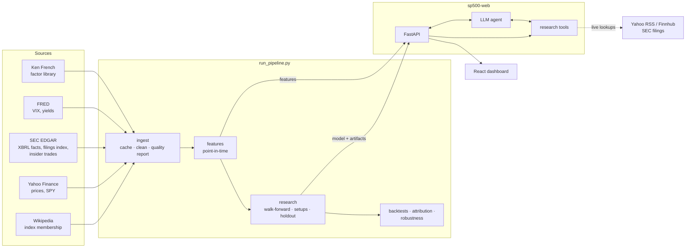

# Architecture

How the system works, from raw downloads to the dashboard. For usage, see [GUIDE.md](GUIDE.md); for results, [FINDINGS.md](FINDINGS.md).



The pipeline writes files: features, a trained model, research artifacts and a report. The server only reads them, so the dashboard keeps working while a new run is in progress, and `POST /api/reload` switches to the new results.

## Modules

| Module | Responsibility |
|---|---|
| `sources/` | One connector per source (`wikipedia`, `yahoo`, `sec`, `fred`, `french`, `insiders`, `news`) plus a shared `http` client with rate limiting and retries |
| `ingest.py` | Assembles a `Dataset` from live, Kaggle or sample data; caching, cleaning, data-quality report |
| `features.py` | Session calendar, price, risk, industry, fundamental, earnings, insider and macro features; delisting-aware forward returns; yes/no and ranked targets |
| `sentiment.py` | Headline sentiment: finance lexicon with negation, optional Loughran-McDonald dictionary or FinBERT |
| `config.py` | Paths, horizons, and `ResearchSpec`, which defines what the model predicts |
| `model.py` | Model zoo (classifiers and rank regressors, plus a fixed-sign anomaly composite), training on non-overlapping dates, tuning inside the training window, scoring the latest date |
| `validation.py` | Walk-forward refits, model comparison by IC, calibration, permutation importance, IC by year/sector/size, IC decay |
| `backtest.py` | Portfolio construction (quantiles, buffers, smoothing, cvxpy optimiser), per-stock spread costs and borrow fees, staggered starts, cost sensitivity |
| `attribution.py` | Home-made factor portfolios and regression; the Fama-French cross-check; Newey-West t-stats |
| `stats.py` | Information coefficients, Newey-West and HAC errors, stationary bootstrap, probabilistic and deflated Sharpe, probability of backtest overfitting |
| `research.py` | Orchestrates a run on the research window: comparison, backtests, robustness, setup experiments, artifacts, report; scores the holdout once on request |
| `forward.py` | Records each run's live ranking and scores past ones as their returns arrive |
| `research_tools.py` | The agent's 15 tools and the data they read |
| `llm_agent.py` | DeepSeek and Claude tool-calling loops; terminal chat |
| `api/server.py` | FastAPI app: JSON endpoints, streamed chat, demo mode, serves the built dashboard |
| `chat.py`, `agent.py` | Rule-based chat and markdown briefs (no LLM) |
| `web/` | React + TypeScript dashboard |

## Data ingestion

**Index membership.** Wikipedia's constituents table gives today's members. The "Historical components" page gives every addition and removal with its date. Walking those changes backwards from today's list reconstructs who was in the index on any date, as `[start, end)` intervals per ticker.
- Since 2014, 758 tickers have been members.
- Changes that can't be placed (usually renamed tickers) are counted in the quality report.

**Prices.**
- **Coverage:** Yahoo prices are downloaded for current members and for every former member since the start date.
- **Two price series:** the dividend-adjusted close drives returns. An *as-traded* price (split adjustment undone, using the split history) pairs with reported share counts to give the market cap of the day.
- **Unfinished sessions:** today's bar is dropped until the market closes.

**Cleaning former members.**
- **Recycled tickers:** a former member whose price history doesn't cover at least half its time in the index is dropped. That usually means the symbol now belongs to another company, or the history was deleted after delisting.
- **After removal:** the rest are trimmed 45 days after leaving the index, long enough for the longest holding period (21 sessions plus the execution lag) to close.
- **Coverage:** in the October 2026 run, 98 of 255 former members kept usable prices.

**Stocks that stop trading.** A stock whose prices end before the data does (other than by the trim above) is listed in `delistings` with a delisting return: −30% when Wikipedia's removal reason mentions bankruptcy or delisting, or the price fell by more than half over its last quarter (Shumway, 1997); 0 otherwise (a merger at about the last price). The features keep these stocks: their forward returns run to the last price, compounded with the delisting return, instead of becoming missing, which would have quietly removed them on the signal date.

**SEC fundamentals.** For each company, the XBRL "company facts" are reduced to a timeline of what was publicly known:
- **Concept merging:** several XBRL concepts per metric are merged, because companies switch tags over time (e.g. `Revenues` to `RevenueFromContractWithCustomer…` after ASC 606).
- **First reported only:** each period keeps its *first-filed* value, so restatements never change history.
- **Trailing 12 months:** four consecutive quarters are chained. A missing fourth quarter is derived as the annual figure minus the first three. Quarters of 80–120 days are accepted, which covers 52/53-week calendars.
- **Year-to-date items:** cash flows (and some income items) are reported year to date in 10-Qs; each quarter is the difference between consecutive year-to-date values.
- **Other fields:** year-on-year revenue growth; gross profit (or revenue minus cost of revenue); operating cash flow; total assets; equity and liabilities (backed out of total assets when liabilities aren't tagged); shares outstanding, summed across share classes.
- **Quarterly EPS** (diluted), as first reported, for the earnings-surprise signal.

**SEC submissions.** Each company's filing index gives its SIC industry code and the dates of its earnings releases (8-K item 2.02). The SIC code supplies the sector of former members, which Wikipedia doesn't record: labelling them "Unknown" would hand the model a flag meaning "this stock will leave the index". `industry` (the two-digit SIC group) is defined the same way for every stock.

**Factor library.** Kenneth French's daily Fama-French five factors, momentum and short-term reversal, for the attribution cross-check.

**Insider trades** (optional, `--insiders`). SEC's quarterly Form 3/4/5 data sets, reduced to open-market purchases and sales of each company's stock by its insiders.

**Caching and quality.**
- **Caching:** each source is cached in `data/raw/live/` with its own maximum age and the parameters it was fetched with.
- **Quality report:** each run records coverage, survivorship, dropped tickers, daily moves above 40%, gaps between trading days and SEC failures. It's shown in the report, the Data page and the agent's `dataset_overview` tool.

## Point-in-time rules

| Input | Usable from |
|---|---|
| Prices, returns, volatility | The close of the same day |
| SEC fundamentals | The day *after* the filing date; treated as unknown after 550 days |
| Earnings surprise (SUE) | The session the earnings release (8-K 2.02) reached the market (releases after 4 pm count for the next day), or the day after the 10-Q when no release is on file |
| Earnings-announcement return | The close of the session after the release |
| Insider trades | The session after the filing date |
| FRED macro series | The next day |
| News (dataset sources) | The same session if before 4 pm New York time, otherwise the next; weekend news moves to Monday |
| Index membership | Each date's own membership |

Cross-sectional ranks and relative targets are computed among that day's index members only. The trading calendar itself is point in time: a date is a session if at least 20% of the busiest day *so far* traded, and every ticker gets a row for each session, so "5 sessions ago" is never "5 rows ago" across a gap.

`tests/test_point_in_time.py` checks all of this at once: features built on data cut at a date must equal, row for row, the same features built on the full history.

## Features and targets

**Features.** Every stock-level signal is ranked among that day's members and mapped to a standard normal score (`<name>_z`); only these normalised scores enter the model.
- **Price:** 5- and 20-day returns, 60-day and 12-1 month momentum, gap to the 50-day average, 20-day volatility, volume against its 20-day average.
- **Industry:** 5- and 20-day returns minus the industry median (short-term reversal within industry, Da, Liu and Schaumburg), and industry momentum (Moskowitz and Grinblatt). Industry is the SIC major group when it has 5+ members that day, otherwise the sector.
- **Risk:** market beta (252 days, against the equal-weighted average return), idiosyncratic volatility, residual momentum (Blitz, Huij and Martens), the largest daily gain of the past month (Bali, Cakici and Whitelaw), price against the 52-week high (George and Hwang).
- **Fundamentals (live SEC data):** earnings yield, sales yield, book-to-market, profit margin, ROE, revenue growth, market cap, gross profitability (Novy-Marx), accruals (Sloan), asset growth (Cooper, Gulen and Schill), net share issuance (Pontiff and Woodgate; split-adjusted).
- **Earnings:** standardised unexpected earnings (SUE) and the three-day abnormal return around the release; both drift after the news.
- **Insiders (optional):** open-market purchases and net buying over about three months.
- **Market conditions:** the VIX against its own past year, and the yield-curve spread. They are the same for every stock on a date, so they can't rank stocks by themselves; they enter as interactions (reversal × VIX, momentum × VIX) and for the tree models.
- **Liquidity:** the Corwin-Schultz bid-ask spread from daily highs and lows, used for trading costs rather than as a model input.
- **Automatic exclusion:** a feature missing on more than 60% of training rows, or constant, is left out.
- **Snapshot fields:** fundamentals from the static Kaggle snapshot are display-only and never ranked, because they'd leak the future.

**Targets.** For each horizon (5 and 21 trading days):
- the forward return and the *tradable* return (enter one session later, hold the horizon), both kept for stocks that stop trading;
- yes/no targets: rises, beats the median member, beats the median of its own sector;
- ranked targets: the percentile of the volatility-scaled forward return among all members, or within the sector. A model of this target predicts the expected percentile, which is also the probability of beating a randomly chosen peer, and keeps the magnitude information a yes/no label throws away.

A peer group needs at least 4 members.

**`ResearchSpec`** picks one target: `horizon` × `relative_to` (`market`, `sector` or `absolute`) × `target` (`binary` or `rank`). It also supplies the column names, the wording used in the app and agent, and the backtest's holding period and portfolio construction. `PRODUCTION_SPEC` (5-day, ranked against all members) is the served one; `EXPERIMENT_SPECS` are compared on every run.

## Validation and model selection

- **Holdout:** research uses dates before `HOLDOUT_START` (default 2025-01-01); labels whose forward window reaches into the holdout are blanked. `run_pipeline.py --evaluate-holdout` scores the frozen production model, hyperparameters and portfolio on the holdout and appends the result, with a timestamp and git commit, to `reports/research/holdout_log.jsonl`, so every look is on record.
- **Refits:** expanding-window walk-forward. The first half of the research dates is training; after that the model is refit every 63 sessions (about a quarter) on everything earlier.
- **Embargo:** each refit trains on dates ending `horizon + 1` sessions before its test block, so no training label overlaps a test label.
- **Independent training rows:** training uses one date per `horizon`-session window, so no two labels share a forward window.
- **Tuning:** a small grid per model is searched inside each training window (fit on its first 75%, scored by rank IC on the rest after a gap).
- **Models:** for yes/no targets, logistic regression, random forest and gradient boosting classifiers; for ranked targets, ridge regression and random forest and gradient boosting regressors. Both get the **anomaly composite**: documented signals with signs fixed from the literature, averaged, nothing fitted. A fitted model that can't beat it isn't earning its complexity.
- **Selection:** the model with the highest Newey-West t-stat of its out-of-sample rank IC. The portfolio trades the ranking, so the ranking is what's scored; AUC (against the median split) and Brier are reported alongside.
- **IC statistics:** the mean daily rank IC, with a Newey-West t-stat (lags = horizon) that uses every date and corrects for overlapping windows; the older t-stat on non-overlapping dates is kept for comparison.
- **Diagnostics:** decile calibration, permutation importance on the last refit's unseen data, the IC of every single feature, the model's IC by year, by sector and by size tercile, and IC decay from 1 to 63 sessions for the model and its strongest inputs.
- **Setup experiments:** the matching linear model (logistic or ridge) runs under each `ResearchSpec`, backtested and attributed. The production setup was fixed before these experiments; the rule's pick (highest IC t-stat) is reported next to it.

**Scoring today.** The final model is refit on all labelled data, holdout included, with the hyperparameters chosen at the last refit. The latest row of each current member is scored and ranked.
- **Stale data:** tickers whose last price is more than 7 days old are skipped.
- **Suspect moves:** stocks with a daily move over 40% in the last 5 sessions are left out, with a reason the agent and dashboard show. These are usually splits or spin-offs that Yahoo hasn't adjusted yet.
- **Stance:** constructive or cautious for the top or bottom 20% of the ranking.
- **Forward test:** each run saves the ranking in `reports/live_signals/`; later runs score saved rankings once their returns are known. Nothing about them could have been tuned on those returns.

## Backtest and attribution

**Backtest** (`run_backtest`). At every `horizon`-th date of the out-of-sample predictions:
1. **Portfolios:**
   - **Long-only:** the top quantile, equal-weighted. With a **buffer** (`exit_quantile`), a holding is only sold once it drops out of a wider band (production: buy in the top 20%, sell below the top 40%). Scores can be **smoothed** over the last few daily predictions (production: 3).
   - **Long-short:** also shorts the bottom quantile, equal-weighted; dollar-neutral.
   - **Optimiser** (`construction="optimizer"`, cvxpy): expected returns from the scores (IC × volatility × z-score, after Grinold), a Ledoit-Wolf risk model from the last 126 days of returns, and per-stock trading costs in the objective, spread over four holding periods (the typical life of a position), so it only trades when the expected gain beats the cost. Charging the full cost against one period's alpha makes it never trade, so its backtest would just hold its first portfolio. Long-only stays within a 4% tracking-error budget against the equal-weight universe; long-short within a 10% volatility budget, neutral to market beta, size and value.
   - **Sector-neutral variant:** picks the top and bottom quantile within every sector of 4 or more stocks.
   - **Benchmarks:** an equal-weight portfolio of all members (the like-for-like reference for an equal-weighted portfolio of members), and SPY (dividends included) over exactly the same entry and exit sessions.
2. **Execution:** enter one session after the signal and hold for the horizon, so rebalances never overlap. Stocks that stop trading stay in until their last price.
3. **Costs:** per unit of weight traded, measured from the previous period's weights *after* they drift with returns. Either flat, or per stock: the configured cost for the median stock, scaled by each stock's Corwin-Schultz spread estimate relative to the day's median (limited to ¼× to 4×). Only the estimator's cross-section is used, because its level overstates large-cap spreads (a median near 50 bps for members, against quoted spreads of a few bps). Optionally an annual borrow fee on shorts.
4. **Statistics:** CAGR, volatility, Sharpe (in excess of the 3-month T-bill for long portfolios; raw for long-short), drawdown, hit rate, turnover, cost drag, excess return and information ratio against both benchmarks, rank IC at rebalances, and returns by prediction quintile.

**Robustness** (all in the report, the Backtest page and the agent's tools):
- **Constructions:** the same predictions traded as the original top 20%, with the buffer, with buffer and smoothing, and through the optimiser.
- **Staggered starts:** the backtest started on each session of the holding period; the range is calendar luck.
- **Cost sensitivity:** net CAGR at flat costs from 0 to 40 bps, and the break-even cost.
- **Bootstrap:** stationary-bootstrap 95% intervals for CAGR, Sharpe and alpha.
- **Multiple testing:** the deflated Sharpe ratio (Bailey and López de Prado) counts every configuration tried (models × constructions × setups); the probability of backtest overfitting comes from combinatorially symmetric cross-validation across every backtest at the production horizon.

**Attribution** (`attribute`). At each rebalance, factor portfolios are built from the same members:
- **SMB:** small minus big by market cap.
- **HML:** cheap minus expensive by book-to-market.
- **MOM:** 12-1 month winners minus losers.

Each takes the top and bottom 30%. MKT is SPY minus T-bills. Each strategy's per-period returns (long-only in excess of T-bills) are regressed on these four factors. The intercept, annualised, is alpha; t-stats use Newey-West (HAC) standard errors. `french_attribution` repeats the regression on Kenneth French's daily factors compounded over each holding window: market, size, value, profitability, investment, momentum and short-term reversal, built by a third party from the whole US market.

## The research agent

**Tools.** `research_tools.py` defines 15 tools as JSON schemas with plain-Python implementations:
- **What they return:** JSON-safe dicts, with NaN converted to null and numbers rounded.
- **Bad input:** arguments are validated, and errors come back as messages the model can act on, such as an unknown ticker with suggested alternatives.
- **Live lookups:** `recent_news` and `recent_filings` call Yahoo RSS or Finnhub and SEC EDGAR, cached per session.

**Loop.** `llm_agent.py` runs a manual tool-calling loop for each provider, with the same tools and system prompt for both:

| | DeepSeek | Claude |
|---|---|---|
| API | OpenAI-compatible Chat Completions | Anthropic Messages (beta endpoint) |
| Default model | `deepseek-v4-pro` | `claude-opus-5-5`, medium effort |
| Extras | none | prompt caching; server-side refusal fallback |
| Tool rounds | up to 8, then answers without tools | up to 8, then answers without tools |

- **History:** append-only. Each turn adds the model's messages exactly as returned, plus the tool results. Rewriting earlier turns would break caching and invalidate the model's earlier reasoning.
- **Truncated tool calls:** if a response is cut off mid-call, the pending call gets an error result so the conversation stays valid.
- **Progress events:** an optional `on_event` callback emits `tool_start` and `tool_end` for each call; the web chat streams these.

**System prompt.** It tells the agent to:
- use only tool data and state the as-of date;
- treat headlines as context, not proof;
- present the model's probabilities as weak, noisy evidence;
- not give buy or sell instructions.

## API and dashboard

**API.** `api/server.py` builds the FastAPI app with `create_app()`, whose arguments make every dependency injectable for tests.
- **Data loading:** research data loads once, thread-safely, and reloads on `POST /api/reload`.
- **Endpoints:** `/api/overview`, `/api/stocks`, `/api/search`, `/api/stocks/{ticker}` (plus `/prices`, `/fundamentals`, `/news`, `/filings`), `/api/backtest`, `/api/model`, `/api/model/report` and `/api/data`. Interactive docs are at `/docs`.
- **Chat:** `POST /api/agent/chat` runs the agent in a worker thread and streams server-sent events (`tool_start`, `tool_end`, then `answer` or `error`).
  - **Sessions:** each browser tab's conversation lives in an LRU cache of up to 50 per-session agents.
  - **Without a key:** the rule-based assistant answers.
- **Demo mode** (`DEMO_MODE=1`):
  - a per-visitor hourly limit (keyed by the first `X-Forwarded-For` address) and a global daily limit on chat;
  - the reload endpoint locked, unless `ADMIN_TOKEN` is set.
- **Frontend serving:** the built frontend (`web/dist`) is served from the same origin, and unknown paths return `index.html` for client-side routing.

**Dashboard** (`web/`).
- **Stack:** Vite + React 19 + TypeScript, styled with Tailwind CSS 4 and design tokens for light and dark themes.
- **Data:** TanStack Query handles fetching and caching. `api.ts` holds the typed client and the server-sent-event reader for chat.
- **Charts:** prices use TradingView Lightweight Charts; analytics use Recharts.
- **Palette:** four colours validated for colour-blind separation in both themes. Every multi-series chart has a legend and tooltips, plus a table of the same numbers.
- **Pages:** `pages/` (Dashboard, Screener, Stock, Agent, Backtest, ModelLab, DataPage).
- **Shared components:** `components/` (layout and ⌘K search, tables, stat tiles, charts).

## Testing and CI

All tests run offline:
- **Connectors:** each runs against canned responses.
- **Ingest:** tested end to end against fake services.
- **Agent loops:** both providers, with scripted fake clients.
- **Synthetic datasets:** an 8-stock random walk, and a 14-stock "live-like" world with fundamentals, macro data and membership changes.

| Area | What the tests pin down |
|---|---|
| Point in time | Features on truncated data equal features on the full history; a filing is invisible on its filing day; earnings news usable only from its release; macro data lagged; only members ranked and traded |
| Leakage | Walk-forward AUC on random-walk data stays near 0.5; folds are ordered and embargoed; the holdout and labels reaching into it are hidden |
| Bias fixes | Former members get a SIC sector or none, never a placeholder; stocks that stop trading keep their returns; sessions, not rows |
| Data | SEC restatements ignored, Q4 derived, share classes summed; membership intervals; recycled tickers dropped |
| Quant | Backtest arithmetic, costs, buffers, smoothing, spread costs and borrow, optimiser constraints, staggered starts, sector-neutral picks, SPY windows; attribution recovers known betas and alpha |
| Statistics | Newey-West shrinks overlapping t-stats; bootstrap intervals cover the truth; deflated Sharpe falls with trials; overfitting probability ≈ 0.5 for noise, low for a real edge |
| Agent and API | Every tool returns strict JSON; tool errors; append-only history; streamed events; demo limits; SPA routing |

`.github/workflows/ci.yml` runs on every push and pull request:
1. **Python tests.**
2. **Dashboard build.**
3. **Docker image build and smoke test:** the container starts on sample data, and the API and front page are checked.

## Project layout

```
run_pipeline.py              data → features → research → backtest → model, artifacts, report
src/sp500_agent/             the Python package (modules above)
web/                         React dashboard (src/pages, src/components, src/lib)
tests/                       pytest suite
docs/                        guide, architecture, findings, deployment, roadmap, media/
scripts/capture_screenshots.py
Dockerfile, docker-compose.yml, docker/entrypoint.sh
.github/workflows/ci.yml
streamlit_app.py             lightweight alternative UI
```
